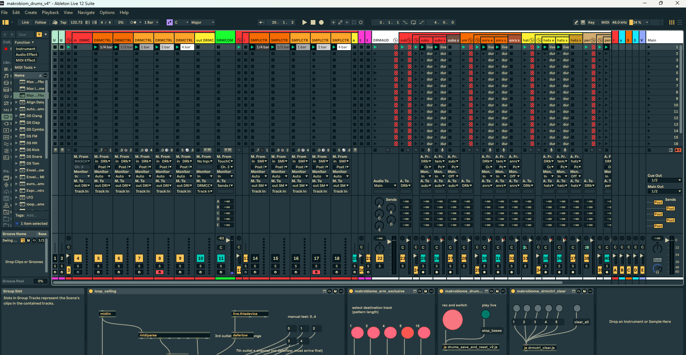
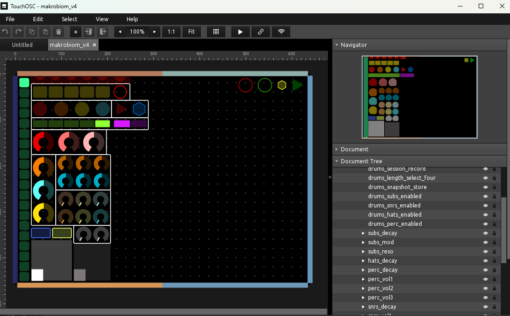

# makrobiom sound system

Live-performance system, played without a mouse: a touchOSC surface drives an
Ableton Live set, a Sugar Bytes DrumComputer engine, and a set of custom Max for
Live devices that handle recording, muting and clearing on musical boundaries.

Two parts: the **drum system**, and the **looper module** — a chain of Ableton
Loopers that layers, transfers short phrases into a long loop, replaces parts of
it, and resamples itself through an effect chain. The looper module lives in its
own set (bass first; the melody module will be the same layout).


*The Live set — DRMCTRL / SMPLCTRL MIDI chains, DRMAUD audio group, and the M4L devices.*


*The touchOSC control surface in the editor.*

---

## Components

- **touchOSC** — control surface, `makrobiom_v4.tosc` + 5 Lua scripts
- **Ableton Live** — `makrobiom_drums_v4.als` (42 tracks), `makrobiom_bass_looper_concept.als` (looper module)
- **Ableton Looper** — 4 per looper module side, driven from MIDI clips
- **Max for Live** — 8 MIDI effects, 3 audio effects
- **Sugar Bytes DrumComputer** — drum engine, `makrobiom_midicc.sbm` CC map + 20 preset banks
- **oeksound soothe3** — on every audio group rack and the master (×5)
- **Valhalla Supermassive** — free plugin, long reverb on return E

---

## Current capabilities

- Play drums from MIDI into DrumComputer, no generated drums in Live
- Record a take into one of 5 length slots (1/4, 1/2, 1, 2, 4 bars)
- Only one length armed at a time, drum + sampler engines armed together
- Clear a length's pattern, per length or all at once
- Global loop-length ceiling across all lengths
- Mute/unmute drum groups (subs / snrs / hats / perc) on musical boundaries
- Mute/unmute recorded audio tracks on musical boundaries
- Momentary Beat Repeat, auto-released on the phrase grid
- Per-group delay / reverb / Valhalla sends, master filter XY
- Undo / redo / tap tempo from the surface
- Swing via Live's Groove Pool (global Groove Amount, switched not swept)

Looper module:

- Record an 8-bar loop, then layer into it for as long as you hold overdub
- Record a 1, 2 or 4-bar phrase and transfer it into the 8-bar loop, repeated
  to fill it — play over the last round to vary only that round
- Replace a stretch of the loop instead of layering, by holding one button
- Resample the loop through an effect chain: what the effects do is baked in on
  every overdub pass, and heard before it is
- Empty every Looper in the set from one button
- Everything is triggered by MIDI clips or mapped buttons — no mouse

---

## Ableton project

### Track tree

```
UTILITY CH2                     4x M4L midi
UTILITY CH9                     1x M4L midi
DRMCTRL (group)
  in DRMCTRL                    -
  DRMCTRL 1 / 2 / 4 / 8 / 16    1x M4L midi each
  out DRMCTRL                   1x M4L midi
DRMCOMP                         VST: DrumComputer  (the drum engine)
SMPLCTRL (group)
  in SMPLCTRL                   -
  SMPLCTRL 1 / 2 / 4 / 8 / 16   -
  out SMPLCTRL                  1x M4L midi
temp (audio) / temp (midi)      reserved for the sample engine (not yet built)
DRMAUD (group)                  [master rack] -> Limiter -> Beat Repeat -> M4L autoswitchoff
  subs aud                      [group rack]
    subs
      subs eng                  Limiter
      subs smpl                 Limiter
    subs save                   M4L track_gate
  snrs aud                      [group rack]
    snrs
      snrs eng                  -
      snrs smpl                 -
    snrs save                   M4L track_gate
  hats aud                      [group rack] -> Compressor
    hats
      hats eng                  -
      hats smpl                 -
    hats save                   M4L track_gate
  perc aud                      [group rack] -> Compressor
    perc
      perc eng                  -
      perc smpl                 -
    perc save                   M4L track_gate
Main                            Limiter
```

### Rack contents

**`[master rack]`** on DRMAUD — one chain:
`OTT (Multiband Dynamics)` → `EQ Eight` → `Mastering - Gentle Limiter (Glue Compressor)` → `Saturator` → `soothe3` → `Auto Filter` → `Auto Filter`

**`[group rack]`** on `subs aud` / `snrs aud` / `hats aud` / `perc aud` — identical in all four, one chain:
`EQ Eight` → `Compressor` → `soothe3` → `Limiter`

### Return tracks

| | name | chain |
|---|---|---|
| A | long rev | EQ Eight → Compressor → Reverb → Compressor |
| B | short rev | EQ Eight → Compressor → Reverb → Compressor |
| C | 35 delay high | EQ Eight → Compressor → Delay → Compressor → Limiter |
| D | 35 delay high | EQ Eight → Compressor → Delay → Delay → Stereo Gain → Compressor |
| E | *(unnamed)* — long reverb | Valhalla Supermassive (free) → Compressor |

The per-group delay / reverb / valhalla CCs (25–30, 39, 40) drive sends into these returns.

### Pattern

The set is three blocks:

1. **Two MIDI chains** — `DRMCTRL` (drum engine) and `SMPLCTRL` (sampler), each
   laid out as `in → 1 / 2 / 4 / 8 / 16 → out`. One length armed at a time,
   both chains follow the same selection.
2. **Utilities** — `UTILITY CH2` and `UTILITY CH9`, carrying the M4L devices that
   are not tied to one track.
3. **One audio group**, nested three deep:

```
DRMAUD                  master bus
  └ <instr> aud         instrument group, carries the group FX rack
      ├ <instr>         "live" group
      │   ├ <instr> eng     live engine output
      │   └ <instr> smpl    sampler output
      └ <instr> save    recorded take, gated by track_gate
```

`<instr>` is one of subs / snrs / hats / perc.

`DRMCOMP` sits outside all of this: it is the single track hosting the
DrumComputer VST, fed by `out DRMCTRL`. The two `temp` tracks (one audio, one
MIDI) are placeholders for the planned drum **sample** engine, which will be
built to mirror the drum engine — its own MIDI chain and its own `smpl` legs
under each instrument group.

---

## Looper module

`makrobiom_bass_looper_concept.als`. One side = 7 tracks + the source. The bass
module has an A and a B side; the melody module will use the same layout with
its own names. Concept doc: `biome_bass_concept.txt`.

### Track tree (A side)

```
SRC                             the instrument, routed into the chain
BASS CTRL A (midi)              M4L looper_bridge  (controller clips)
BASS LOOP A 1                   Looper, 1 bar      short
BASS LOOP A 2                   Looper, 2 bars     short
BASS LOOP A 4                   Looper, 4 bars     short
BASS RET A                      M4L looper_replace (the loop coming back)
BASS SHAPE A                    effect chain, limiter last
BASS LOOP A 8                   Looper, 8 bars     the main loop
```

### Routing

| track | Audio From | Monitor | Audio To |
|---|---|---|---|
| `BASS LOOP A 1` | `SRC` / Post FX | In | Sends Only |
| `BASS LOOP A 2` | `BASS LOOP A 1` / Post FX | In | Sends Only |
| `BASS LOOP A 4` | `BASS LOOP A 2` / Post FX | In | `BASS SHAPE A` |
| `BASS RET A` | `BASS LOOP A 8` / `Insert-Looper` | In | Sends Only |
| `BASS SHAPE A` | `BASS RET A` / Post FX | In | `BASS LOOP A` (the module out, → Main) |
| `BASS LOOP A 8` | `BASS SHAPE A` / Post FX | In | Sends Only |

Every Looper: Input → Output **Always**, Quantization **None**, Song Control
**None**, Tempo Control **Follow song tempo**. Short Loopers: Record Length 1 /
2 / 4 bars, Overdub after recording, Feedback **100%**. The 8-bar Looper:
Record Length 8 bars, Play after recording, Feedback **0%**.

### Pattern

The main Looper's own Feedback is off. Its loop survives an overdub pass because
it leaves through the `Insert-Looper` tap, passes `BASS RET A` and `BASS SHAPE A`,
and arrives back at its **track input** — external feedback in place of the
internal kind. That is what makes the three modes possible, and all three are
switched by audio, not by Looper settings:

| mode | Looper | `BASS RET A` | result |
|---|---|---|---|
| play | Play | open | nothing is written |
| layer | Overdub | open | loop + what you play |
| replace | Overdub | **muted** | only what you play, for as long as it is held |

`BASS SHAPE A` is the only track you hear: the chain (live playing plus the short
loops) and the returning loop, with the effects. Because it sits inside the loop,
its effects are re-applied on every overdub pass — the iterative resampling of the
melody sessions — so it needs a limiter last and unity gain.

A **transfer** fills the long loop from a short one: the short Looper records its
1, 2 or 4 bars and then repeats, overdubbing, until bar 9, while the 8-bar Looper
overdubs the whole time. Play along in the last round and only that round differs.
The short Looper is stopped and cleared at bar 9.

### Controller clips

One clip per action on `BASS CTRL A`, all triggered on the bar; the Loopers
themselves are unquantized, so the clips do the timing.

| clip | notes | length |
|---|---|---|
| record first | C0 (24) | short, **loop off** — one note, at 1 |
| overdub 8 bar | C1 (36) | 8 bars, 1 → 9 |
| overdub 1 bar | C3 (60) + C1 | 8 bars, both 1 → 9 |
| overdub 2 bar | C#3 (61) + C1 | 8 bars, both 1 → 9 |
| overdub 4 bar | D3 (62) + C1 | 8 bars, both 1 → 9 |

The record note sits **on** the bar, not before it: an unquantized Looper starts
when the note plays. A fixed-length recording replays what it heard exactly one
loop length later, so on-grid playing stays on grid and only the loop's seam
moves.

---

## Max for Live devices

### MIDI effects

| device | purpose | how |
|---|---|---|
| **note_gate_eng** | mute drum groups without stopping the clip | `[table pitchallow]` lookup per pitch gates note-ons; note-offs always pass. Mutes land on the next beat, un-mutes on the next bar — two `[delay @quantize]` one-shots armed by the push |
| **arm_exclusive** | one length armed at a time | button 1–5 arms the matching DRMCTRL + SMPLCTRL pair, disarms all others |
| **drmctrl_clear** | wipe a length's pattern | clears all MIDI notes from the first-row clip of a DRMCTRL track and its SMPLCTRL counterpart |
| **drums_save_and_reset** | record a take, then reset | records the clips, launches the base dummy clips at the closing bar line, clears both engines after the take |
| **LoopCeiling** | cap all loop lengths at once | track name encodes natural length; sets `loop_end = loop_start + min(natural, L)`. Stateless. Hardcoded to CC 43 |
| **midi_undo_redo** | undo / redo from the surface | sends Ctrl+Z / Ctrl+Shift+Z |
| **looper_bridge** | a MIDI clip drives the four Loopers of one module side | C0 (24) → 8-bar `record`, C1 (36) note-on/off → 8-bar `overdub`/`play`; C3 (60) / C#3 (61) / D3 (62) → `record` on the 1-, 2- and 4-bar Looper, note-off → `stop`, `clear` 100 ms later. C1 note-off stops a still-held short Looper before the 8-bar goes to `play`. Transport stop does nothing. Four name fields, empty = unused. Loopers unquantized, clips do the timing. Replaces `looper_overdub_bridge` and `bass_looper_bridge` (now in `deprecated/`). See `looper_bridge_README.txt` |
| **looper_clear_all** | empty every Looper from one button | MIDI-mappable `live.text` button → `stop` on each Looper named in its eight fields, `clear` 100 ms later |

### Audio effects

| device | purpose | how |
|---|---|---|
| **track_gate** | switch a track's sound on the grid | `live.toggle` stores into `[int]` cold inlet; a `[delay @quantize]` one-shot releases it — off on the next beat, on at the next bar. 10 ms `[line~]` ramp, no click |
| **autoswitchoff_param_at_2bar** | momentary Beat Repeat (sits on DRMAUD) | press → `Repeat` on at the next 16th → off at the next 2-bar boundary of the song. Binds by name (DRMAUD / BeatRepeat / Repeat) via `autoswitchoff_target.js`, not by index |
| **looper_replace** | overdub a Looper that replaces instead of adds (sits on the loop's return track) | MIDI-mappable toggle: on → `overdub` + the device's own audio (the return) fades out in 30 ms; off → fades back in, then `play`. Needs the Feedback-0 return-through-track-input routing. One name field. See `looper_replace_README.txt` |

> All timing uses one-shot `[delay @quantize]` armed by the push, never a
> free-running `[metro]` — a metro started at device load free-runs with a phase
> set by load time and lands on an arbitrary beat.

---

## touchOSC

- `makrobiom_v4.tosc` — 24 buttons, 20 radials, 3 radios, 2 XY pads, 18 boxes, 25 groups
- 49 MIDI bindings, two pages: `drum_controls_ch2`, `utils_ch9`
- Lua: `root_v4_base`, `root_container_for_radial`, `toggle_switches`, `subs_mod_controls`, `play_stop_transport`

---

## MIDI mapping

### Channel 2 — drum controls

| CC | control | goes to |
|---|---|---|
| 0–4 | length select 1/4, 1/2, 1, 2, 4 | Live |
| 5 | session record | Live (session record) |
| 6 | snapshot store | Live |
| 7, 8 | short / long enable | Live (no surface control) |
| 9–12 | subs / snrs / hats / perc enable | Live → note_gate |
| 13 | subs reso | DrumComputer |
| 14–16 | perc vol 1–3 | DrumComputer |
| 17–19 | snrs vol 1–3 | DrumComputer |
| 25, 26 | snrs delay, reverb | Live |
| 27, 28 | hats delay, reverb | Live |
| 29, 30 | perc delay, reverb | Live |
| 31–36 | clear 1/4, 1/2, 1, 2, 4, all | Live |
| 37 | live playing again | Live |
| 39, 40 | hats, perc valhalla | Live |
| 41, 42 | midi echo, beat repeat | Live |
| 43 | global set length | M4L (LoopCeiling) |
| 44, 45 | master filter X / Y | Live |
| 46, 47 | master NA X / Y | unassigned |
| 48 | swing | Live (Groove Amount) |
| 86, 90, 94, 98 | subs, snrs, hats, perc decay | DrumComputer |

### Channel 9 — utils

| CC | control |
|---|---|
| 10 | undo |
| 11 | redo |
| 12 | tap tempo |

**Counts:** touchOSC sends 45 CCs on ch2; the Live set holds 32 CC mappings.
The 14 that are not Live mappings go to DrumComputer or are read inside a M4L
device (CC 43 → LoopCeiling). CC 7 and 8 are mapped in Live but have no surface control yet.

> The channel field inside the `.tosc` is 0-based: `channel 1` = MIDI channel 2,
> `channel 8` = MIDI channel 9.

### Looper module notes (from clips on the control track)

| note | | drives |
|---|---|---|
| C0 | 24 | 8-bar Looper `record` |
| C1 | 36 | 8-bar Looper `overdub` (note-off → `play`) |
| C3 | 60 | 1-bar Looper `record` (note-off → `stop` + `clear`) |
| C#3 | 61 | 2-bar Looper `record` |
| D3 | 62 | 4-bar Looper `record` |

Live's note names: middle C (60) is C3. The replace toggle and the clear-all
button are MIDI-mapped instead, not clip-driven; one control can drive several
parameters, so one button clears every module.

### Note map (DrumComputer, notes 36–51)

| group | pitches |
|---|---|
| subs | 36, 37 |
| snrs | 38, 39, 44, 45 |
| hats | 40, 41, 46, 47 |
| perc | 42, 43, 48, 49, 50, 51 |

---

## Notes

- Recorded audio (`Samples/`) is not versioned — see `.gitignore`
- `deprecated/` holds superseded versions, kept deliberately
- `.amxd` files are the built devices; `.maxpat` + `.js` beside them are the source
